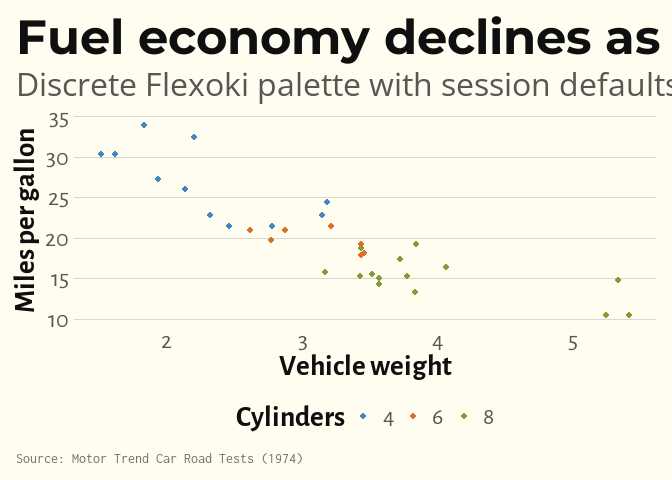
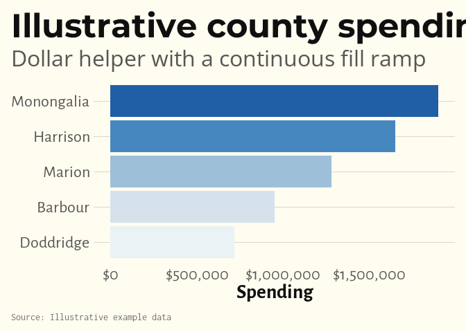
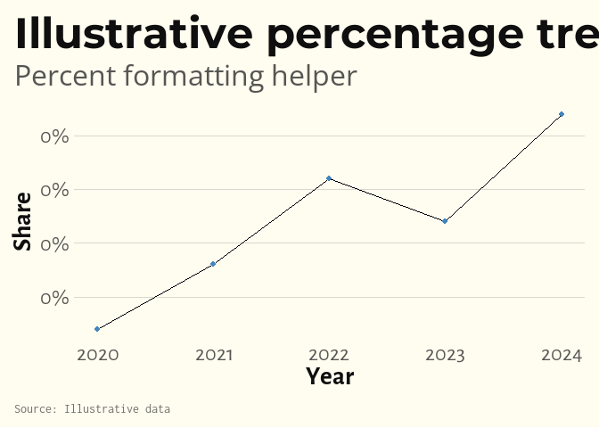
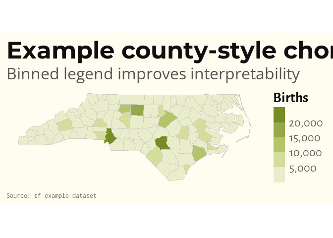

<!-- README.md is generated from README.Rmd. Please edit that file -->

# workmanThemes

<!-- badges: start -->

<!-- badges: end -->

**workmanThemes** provides a consistent set of ggplot2 themes, colour
palettes, and scale helpers inspired by the
[Flexoki](https://stephango.com/flexoki) colour system. It is designed
for clean, publication-ready figures with minimal boilerplate.

## Features

- **`theme_workman()`** / **`theme_workman_map()`** — custom ggplot2
  themes with Montserrat headings and Open Sans body text.
- **Discrete, continuous, diverging, and binned colour scales** —
  `scale_colour_workman_d()`, `scale_fill_workman_c()`,
  `scale_colour_workman_div()`, `scale_fill_workman_b()`, etc.
- **Map-ready scales and geom** — `scale_fill_workman_map_b()`,
  `scale_fill_workman_map_c()`, and `geom_sf_workman()`.
- **Label helpers** — `scale_x_dollar_workman()`,
  `scale_y_percent_workman()`, and friends.
- **`labs_workman()`** — a `labs()` wrapper that adds an optional
  `source` caption.
- **`use_workman()`** — one-call session setup that registers fonts,
  sets defaults, and optionally applies the map theme.

## Installation

Install the development version from GitHub:

``` r
# install.packages("pak")
pak::pak("SamuelWorkman/workmanThemes")
```

## Quick start

``` r
library(ggplot2)
#> Warning: package 'ggplot2' was built under R version 4.5.2
library(workmanThemes)

use_workman()
```

### Discrete colour palette

``` r
ggplot(mtcars, aes(wt, mpg, colour = factor(cyl))) +
  geom_point() +
  scale_colour_workman_d() +
  labs_workman(
    title = "Fuel economy declines as vehicle weight increases",
    subtitle = "Discrete Flexoki palette with session defaults",
    x = "Vehicle weight",
    y = "Miles per gallon",
    colour = "Cylinders",
    source = "Motor Trend Car Road Tests (1974)"
  )
```



### Continuous fill with dollar formatting

``` r
df <- data.frame(
  county = c("Barbour", "Doddridge", "Harrison", "Marion", "Monongalia"),
  spending = c(950000, 720000, 1650000, 1280000, 1900000)
)

ggplot(df, aes(x = reorder(county, spending), y = spending, fill = spending)) +
  geom_col() +
  coord_flip() +
  scale_fill_workman_c(palette = "blue") +
  scale_y_dollar_workman() +
  labs_workman(
    title = "Illustrative county spending",
    subtitle = "Dollar helper with a continuous fill ramp",
    x = NULL,
    y = "Spending",
    source = "Illustrative example data"
  ) +
  theme(legend.position = "none")
```



### Percent formatting

``` r
df <- data.frame(
  year = 2020:2024,
  share = c(0.21, 0.24, 0.28, 0.26, 0.31)
)

ggplot(df, aes(year, share)) +
  geom_line() +
  geom_point(colour = workman_cols("blue")) +
  scale_y_percent_workman(scale = 1) +
  labs_workman(
    title = "Illustrative percentage trend",
    subtitle = "Percent formatting helper",
    x = "Year",
    y = "Share",
    source = "Illustrative data"
  )
```



### Choropleth maps

``` r
library(sf)
#> Warning: package 'sf' was built under R version 4.5.2
#> Linking to GEOS 3.13.1, GDAL 3.11.4, PROJ 9.7.0; sf_use_s2() is TRUE

use_workman(map = TRUE)

nc <- sf::st_read(
  system.file("shape/nc.shp", package = "sf"),
  quiet = TRUE
)

ggplot(nc) +
  geom_sf_workman(aes(fill = BIR74)) +
  scale_fill_workman_map_b(
    palette = "green",
    labels = scales::label_comma()
  ) +
  labs_workman(
    title = "Example county-style choropleth",
    subtitle = "Binned legend improves interpretability",
    fill = "Births",
    source = "sf example dataset"
  )
```



## Learn more

See the package function documentation for full details on available
palettes, scales, and customisation options.
